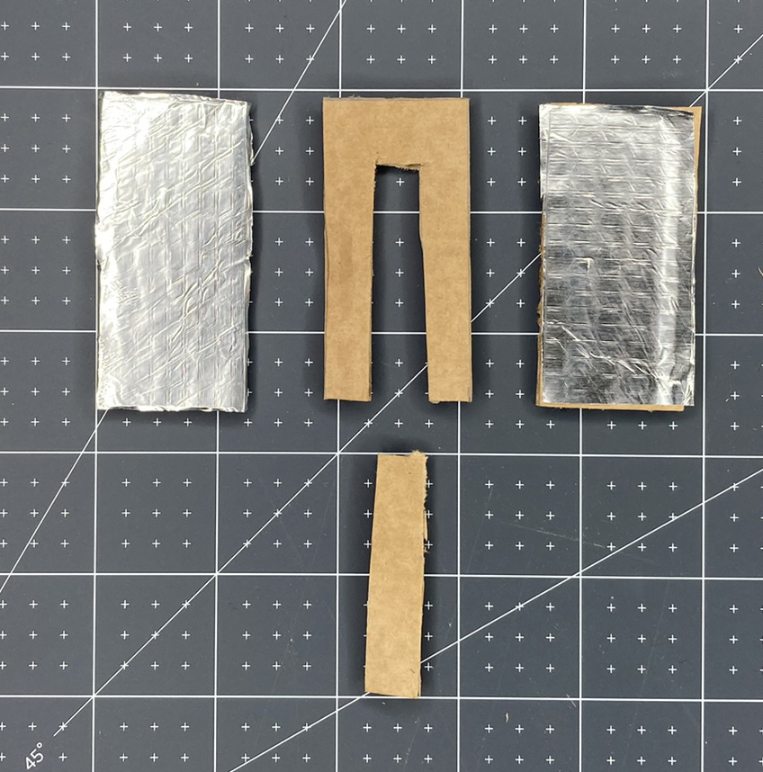
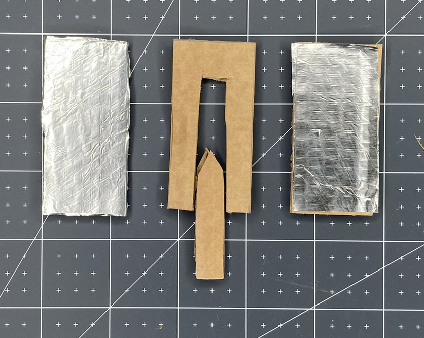
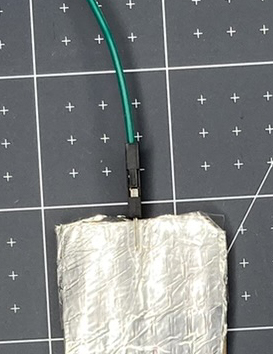

--- task ---

Now that you know your code is working, you need to make the switch that will set off your party popper! 
First, you need to gather your materials:

- A pair of scissors
- Corrugated card
- Aluminium foil
- A glue stick
- Some sticky tape

**Optional**:

- A pencil and a ruler (if you want to be more precise with your make)
- Some nice ribbon OR string OR coloured paper/card OR plain paper that you have coloured in

--- /task ---

--- task ---

Cut the **corrugated card** into three rectangles that are the same size. You can decide on the size of your party popper. The example is 3cm x 5cm. 

**Tip**: If you don't have a pencil and a ruler then cut the first one and then use it as a template for the other two. 

**Optional**: You don't have to use a rectangle shape, you could do a circle or a rocket or anything you like! You will need to make sure though that you follow similar steps to make the switch close and open as expected. 

--- /task ---

--- task ---

**Cut** a section out of the centre of one of your rectangles. Keep the piece of card that you have cut out as this will be used later. 

--- /task ---

--- task ---

Take the **aluminium foil** and cut it to the same size as the un-cut rectangles. 

Next, **glue** the cardboard and attach the foil. Make sure you don't get too much glue on the outside of the foil, or it will affect the contacts of the switch. 

--- /task ---

--- task ---

Now take the piece of card that you removed from the centre rectangle and cut a V shape out of the top to make it easier to place it inside your popper.

Next, **trim** the sides by a few millimetres to make sure that it will easily fit into your popper.

--- /task ---

--- task ---

Now, cover the removed piece in **aluminium foil**. It is very important that you use one piece of foil and that it wraps all the way around. This is what will make the switch close and allow the current to flow.

--- /task ---

--- task ---

**Remove** the two jumper wires that you used for your test switch above that are attached to **GP18** and the **GND** pin. 

Next, use some sticky tape to secure them to the top of each rectangle. It is important that the pins make a secure contact with the aluminium foil. Make sure that each pin is lying flat against the foil with the plastic part of the jumper wire against the edge of the cardboard. 

Add more tape to secure the jumper wire and stop it from accidentally coming loose.

--- /task ---

--- task ---

**Test**: At this point it is a good time to test that your connections are secure. 

Attach your jumper wires back to **GP18** and **GND**. 

**Run** your code to see if it works. The RGB LED should light and the tone should play when the switch is open. You can close and open the switch by touching the two foil ends of the rectangle together.

--- /task ---