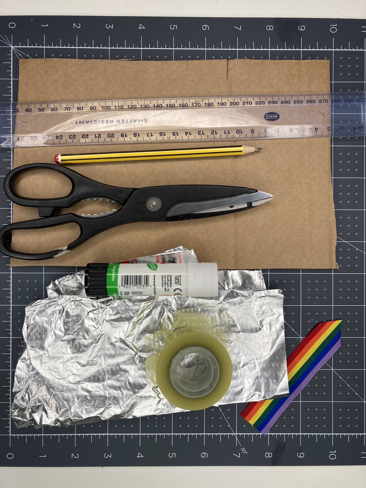
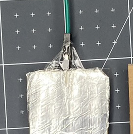

To create a pull switch, you will need:

- A pair of scissors
- Corrugated card
- Aluminium foil
- A glue stick
- Some sticky tape

**Optional**:

- A pencil and a ruler (if you want to be more precise with your make)
- Some nice ribbon OR string OR coloured paper/card OR plain paper that you have coloured in

**Instructions**

**Step 1:** Cut the **corrugated card** into three rectangles that are the same size. 

**Step 2:** Cut a section out of the centre of one of your rectangles. Keep the piece of card that you have cut out as this will be used later. 

**Step 3:** Take the **aluminium foil** and cut it to the same size as the un-cut rectangles. 

**Step 4:** Glue the cardboard and attach the foil. Make sure you don't get too much glue on the outside of the foil, or it will affect the contacts of the switch. 

**Step 5:** Take the piece of card that you removed from the centre rectangle and cut a V shape out of the top to make it easier to place it inside your switch.

**Step 6:** Trim the sides by a few millimetres to make sure that it will easily fit into your popper.

**Step 7:** Cover the removed piece in **aluminium foil**. It is very important that you use one piece of foil and that it wraps all the way around. This is what will make the switch close and allow the current to flow.

 

**Step 8:** Next, use some sticky tape to secure the pin end of two jumper wires to the top of each rectangle. It is important that the pins make a secure contact with the aluminium foil. Make sure that each pin is lying flat against the foil with the plastic part of the jumper wire against the edge of the cardboard. 

**Step 9:** Add more tape to secure the jumper wire and stop it from accidentally coming loose.

**Step 10:** Add glue to one side of the middle piece and stick it to the left rectangle. This will create a barrier between the two pieces of foil and allow space for your centre piece to be placed inside. 

**Step 11:** Add glue to the other side of the middle piece and stick the foil face of your other rectangle on top. Make sure that the two pieces of foil **are not** touching. You may need to trim your foil if it is overlapping.

Now use your switch with your project!