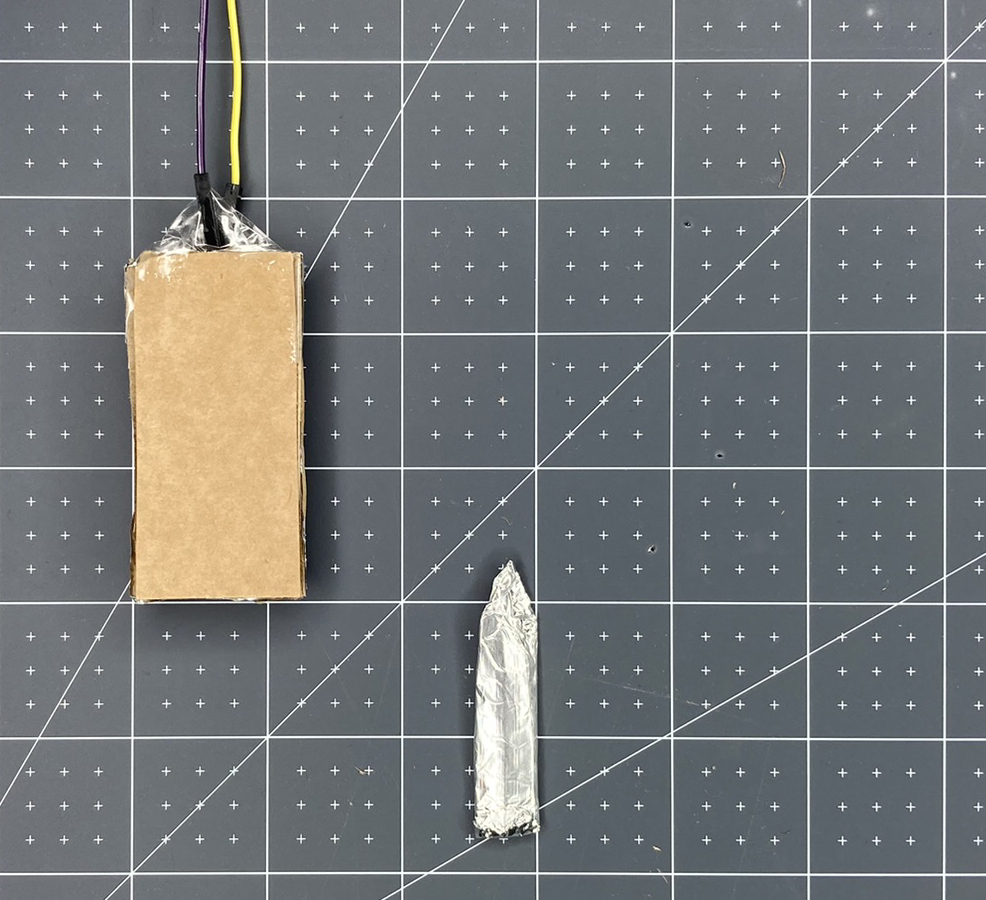

Pour créer un interrupteur à tirette, tu auras besoin de :

- Une paire de ciseaux
- Du carton ondulé
- Papier d'aluminium
- Un bâton de colle
- Du ruban adhésif

**Facultatif** :

- Un crayon et une règle (si tu veux être plus précis avec ce que tu fais)
- Du joli ruban OU de la ficelle OU du papier/carte de couleur OU du papier ordinaire que tu as colorié

**Instructions**

**Étape 1 :** Coupe la **carte ondulée** en trois rectangles de même taille.

**Étape 2 :** Découpe une section au centre de l'un de tes rectangles. Conserve le morceau de carton que tu as découpé, car il servira plus tard.

**Étape 3 :** Prends le **papier d'aluminium** et coupe-le à la même taille que les rectangles non découpés.

**Étape 4 :** Colle le carton et attache le papier d'aluminium. Assure-toi de ne pas avoir trop de colle à l'extérieur de l'aluminium, ou cela affectera les contacts de l'interrupteur.

**Étape 5 :** Prends le morceau de carton que tu as retiré du rectangle central et découpe une forme en V sur le dessus pour faciliter son placement à l'intérieur de ton interrupteur.

**Étape 6 :** Coupe les côtés de quelques millimètres pour t'assurer qu'il s'insérera facilement dans ton interrupteur.

**Étape 7 :** Recouvre la pièce retirée de **papier d'aluminium**. Il est très important que tu utilises un morceau de papier d'aluminium et qu'il s'enroule tout autour. C'est ce qui fera fermer l'interrupteur et permettra au courant de circuler.

**Étape 8 :** Ensuite, utilise du ruban adhésif pour fixer l'extrémité de la broche de deux fils de liaison au sommet de chaque rectangle. Il est important que les broches fassent un contact sécurisé avec le papier d'aluminium. Assure-toi que chaque broche est à plat contre le papier d'aluminium avec la partie plastique du fil de liaison contre le bord du carton.

**Étape 9 :** Ajoute plus de ruban adhésif pour fixer le fil de liaison et l'empêcher de se détacher accidentellement.

**Étape 10 :** Ajoute de la colle sur un côté de la pièce du milieu et colle-la sur le rectangle de gauche. Cela créera une barrière entre les deux morceaux de papier d'aluminium et laissera de l'espace pour que ta pièce centrale soit placée à l'intérieur.

**Étape 11 :** Ajoute de la colle de l'autre côté de la pièce du milieu et colle la face en aluminium de ton autre rectangle sur le dessus. Assure-toi que les deux morceaux de papier d'aluminium **ne se touchent pas**. Il se peut que tu doives couper ta feuille de papier d'aluminium si elle se chevauche.

Maintenant utilise ton interrupteur avec ton projet !