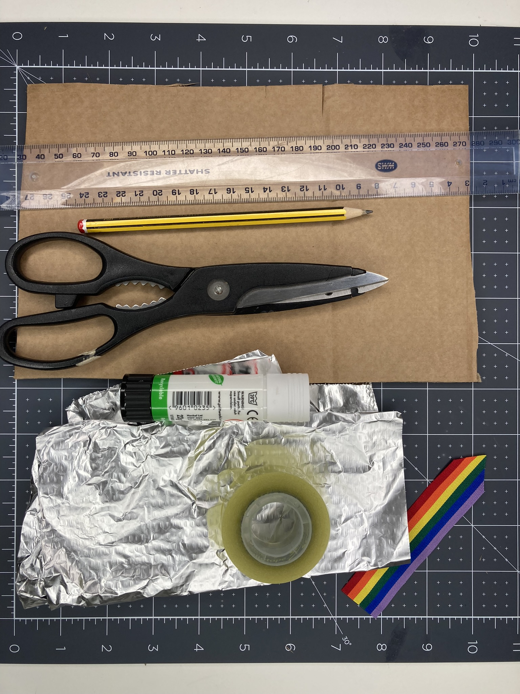
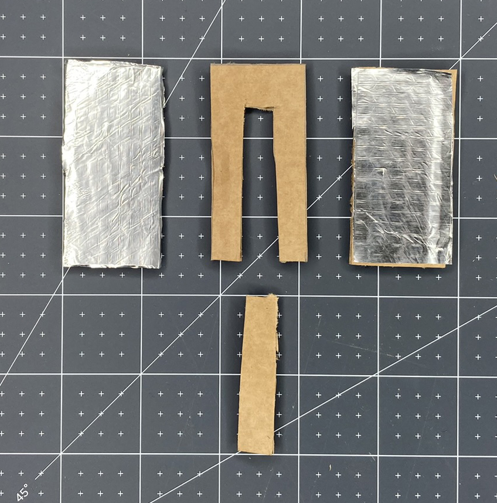
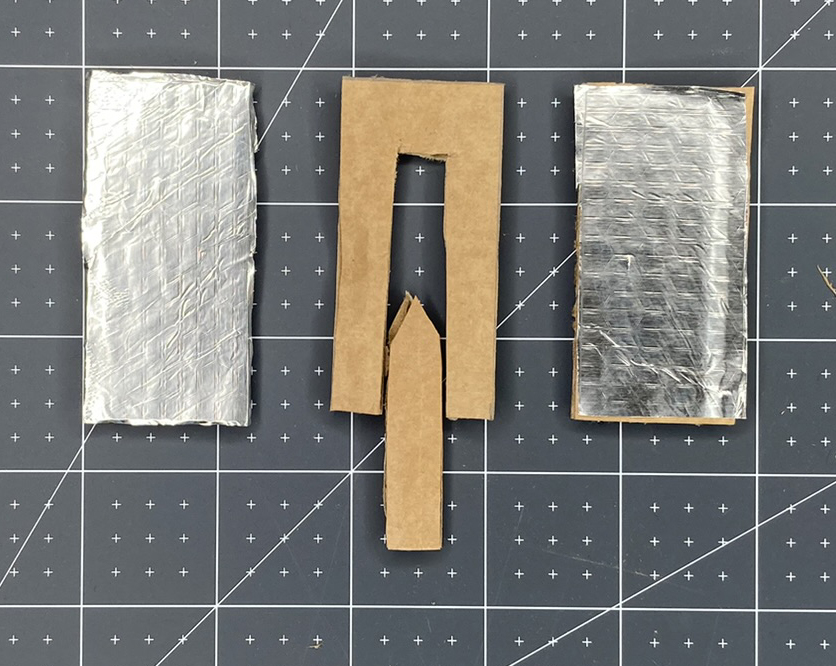
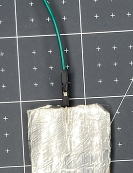
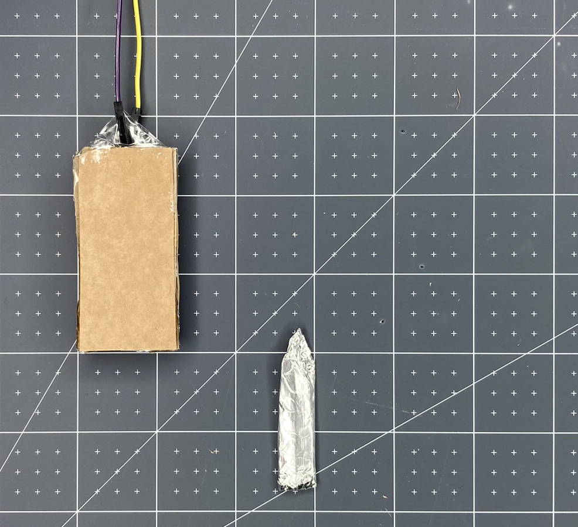

Om een trekschakelaar te maken, heb je nodig:

- Een schaar
- Golfkarton
- Aluminiumfolie
- Een Pritt-stift
- Wat plakband

**Naar eigen keuze**:

- Een potlood en een liniaal (als je nauwkeuriger wilt zijn)
- Een lint, draad, gekleurd papier/karton of een wit vel papier dat je zelf hebt ingekleurd

**Instructies**

**Stap 1:** Snijd het **golfkarton** in drie rechthoeken van dezelfde grootte.

**Stap 2:** Knip een stuk uit het midden van een van je rechthoeken. Bewaar het stukje karton dat je hebt uitgeknipt, want dit wordt later gebruikt.

**Stap 3:** Neem de **aluminiumfolie** en knip deze in hetzelfde formaat als de ongesneden rechthoeken.

**Stap 4:** Lijm het karton en bevestig de folie. Zorg ervoor dat je niet te veel lijm aan de buitenkant van de folie krijgt, anders tast dit de contacten van de schakelaar aan.

**Stap 5:** Pak het stuk karton dat je uit de middelste rechthoek hebt gehaald en knip een V-vorm uit de bovenkant om het gemakkelijker te maken om het in je schakelaar te plaatsen.

**Stap 6:** Knip de zijkanten een paar millimeter bij zodat hij makkelijk in je middenstuk past.

**Stap 7:** Bedek het verwijderde stuk in **aluminiumfolie**. Het is heel belangrijk dat je één stuk folie gebruikt en dat het helemaal omringd wordt. Dit is wat de schakelaar sluit en de stroom laat stromen.

**Stap 8:** Gebruik vervolgens wat plakband om het pinuiteinde van twee verbindingsdraden aan de bovenkant van elke rechthoek te bevestigen. Het is belangrijk dat de pinnen goed contact maken met de aluminiumfolie. Zorg ervoor dat elke pin plat tegen de folie ligt met het plastic gedeelte van de verbindingsdraad tegen de rand van het karton.

**Stap 9:** Voeg meer tape toe om de verbindingsdraad te beveiligen en te voorkomen dat deze per ongeluk loskomt.

**Stap 10:** Voeg lijm toe aan één kant van het middelste stuk en bevestig het aan de linker rechthoek. Dit creëert een barrière tussen de twee stukken folie en maakt de ruimte vrij om je middenstuk erin te plaatsen.

**Stap 11:** Voeg lijm toe aan de andere kant van het middelste stuk en bevestig de foliekant van de andere rechthoek bovenop. Zorg ervoor dat de twee stukken folie elkaar **niet** raken. Mogelijk moet je folie bijknippen als het overlapt.

Gebruik nu je trekschakelaar met je project!